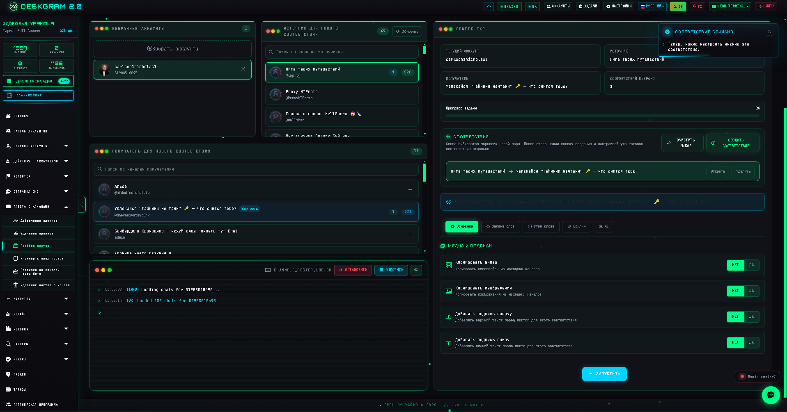
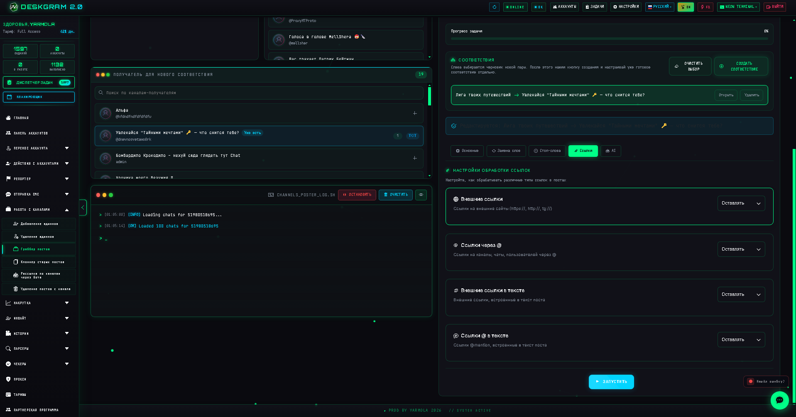
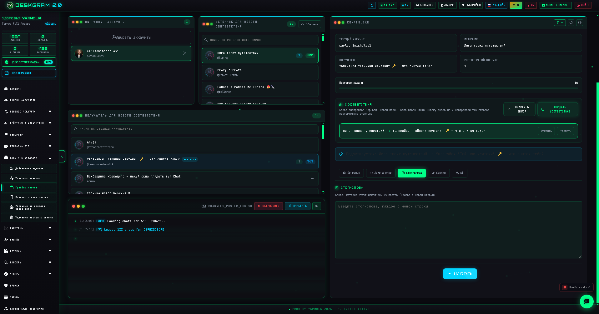
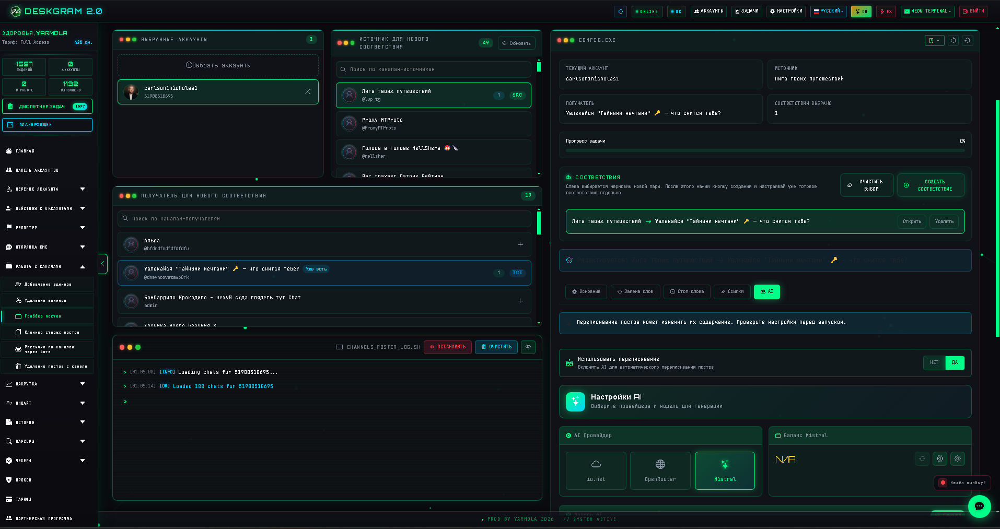

# Граббер постов Telegram-каналов в Deskgram 2

Граббер постов в Deskgram 2 помогает забирать контент из Telegram-каналов и собирать новые публикационные маршруты между источниками и получателями. Этот модуль полезен, когда нужно не только переиспользовать старые посты, но и гибко управлять медиаблоками, текстовыми добавками, ссылками, заменами и AI-переписыванием.

[Главный хаб Deskgram 2](https://github.com/Deskgram-2/deskgram-2-telegram-automation) · [Сайт](https://deskgram2.com/) · [Telegram-бот](https://t.me/DG2welcomebot) · [Web preview](https://deskgram2.com/web-preview?path=%2Fapp-demo%2F&lang=ru)

## Интерактивный Web Preview

Попробовать модуль в браузере: [Открыть веб-превью](https://deskgram2.com/web-preview?path=%2Fapp-demo%2Ffunctions%2Fchannel_poster&lang=ru)

Так можно заранее посмотреть карточки соответствий, настройки медиа и AI-блок до того, как выстраивать реальную контентную воронку.

## Скриншоты

## Кратко о модуле

| Параметр | Что внутри |
|---|---|
| Основная задача | Граббинг и пересборка Telegram-постов между каналами |
| Важные блоки | Соответствия, медиа-настройки, текст сверху и снизу, замены, ссылки, AI |
| Полезен для | Контентных сеток, перепаковки чужих или своих постов, адаптации материалов |
| Связанные модули | Клоннер постов, постинг по каналам, создание каналов, диспетчер задач |

## Что умеет модуль

- собирать пары источник -> получатель для отдельных контентных маршрутов;
- клонировать видео и изображения по настройкам;
- добавлять текст до и после основного поста;
- применять замены, стоп-слова, ссылочные правила и AI-переписывание;
- сохранять несколько разных соответствий внутри одного рабочего сценария.

## Быстрый старт

1. Выберите аккаунт и обновите список каналов.
2. Соберите первое соответствие между источником и получателем.
3. Настройте правила по медиа, подписям, заменам и ссылкам.
4. При необходимости включите AI-переписывание для текста.
5. Запустите модуль и проверьте результат по логам и прогрессу.

## С чем особенно хорошо работает этот сценарий

- [Клоннер старых постов](https://github.com/Deskgram-2/telegram-channel-post-cloner-deskgram), если нужен соседний более простой сценарий переноса архива по соответствиям;
- [Постинг по каналам](https://github.com/Deskgram-2/telegram-channel-posting-deskgram), если после пересборки контент должен уходить в централизованную публикацию;
- [Создание каналов и групп](https://github.com/Deskgram-2/telegram-channel-creator-deskgram), если площадки под новую сетку еще только создаются;
- [Диспетчер задач](https://github.com/Deskgram-2/telegram-task-manager-deskgram), если граббинг и публикацию нужно держать в общем рабочем потоке.

## Как устроен сценарий

### Черновик пары

Сначала выбирается черновая пара источник -> получатель. После этого создается отдельное соответствие, которое можно настраивать как самостоятельный маршрут.

### Редактор соответствия

Для каждого соответствия доступны свои медиа-настройки, текстовые добавки, замены, стоп-слова и ссылочные правила. Это удобно, когда один и тот же источник должен по-разному перерабатываться для нескольких каналов.

### AI-переписывание

AI-вкладка помогает превратить прямой перенос постов в более адаптированный сценарий. Это особенно полезно, если нужно снизить шаблонность и сделать контент ближе к формату целевого канала.

## Когда особенно полезен

- когда один источник нужно использовать для нескольких каналов с разной упаковкой;
- когда важно отдельно управлять медиа, текстом и ссылками;
- когда нужен более гибкий контентный модуль, чем простой перенос архива;
- когда контент нужно сначала переработать, а потом передать дальше в публикационную цепочку.

## Что выбрать: граббер постов или клоннер постов

| Если задача такая | Лучше использовать |
|---|---|
| Нужен более управляемый маршрут с настройкой медиа, подписей и AI | [Граббер постов](https://github.com/Deskgram-2/telegram-channel-post-grabber-deskgram) |
| Нужно быстрее переносить старые посты между каналами | [Клоннер старых постов](https://github.com/Deskgram-2/telegram-channel-post-cloner-deskgram) |
| Нужно глубже перерабатывать контент под разные получатели | Граббер постов |
| Нужен более легкий сценарий повторного использования архива | Клоннер постов |

## Что выбрать: граббер постов или канал-постинг

| Если задача такая | Лучше использовать |
|---|---|
| Контент нужно взять из канала-источника и адаптировать | [Граббер постов](https://github.com/Deskgram-2/telegram-channel-post-grabber-deskgram) |
| Контент уже подготовлен и его надо просто разложить по каналам | [Постинг по каналам](https://github.com/Deskgram-2/telegram-channel-posting-deskgram) |
| Нужен путь "забрать -> адаптировать -> опубликовать" | Граббер + канал-постинг |
| Нет задачи работать с каналом-источником | Канал-постинг |

## Смежные репозитории

- [Главный хаб Deskgram 2](https://github.com/Deskgram-2/deskgram-2-telegram-automation)
- [Клоннер старых постов](https://github.com/Deskgram-2/telegram-channel-post-cloner-deskgram)
- [Постинг по каналам](https://github.com/Deskgram-2/telegram-channel-posting-deskgram)
- [Создание каналов и групп](https://github.com/Deskgram-2/telegram-channel-creator-deskgram)
- [Диспетчер задач](https://github.com/Deskgram-2/telegram-task-manager-deskgram)

## FAQ

### Можно ли сначала посмотреть модуль в браузере?

Да. В веб-превью можно заранее открыть список соответствий, настройки медиа и AI-вкладку до реального запуска.

### Этот модуль только копирует текст?

Нет. Здесь как раз сильная сторона в том, что можно отдельно управлять видео, изображениями, подписями, заменами и AI-переписыванием.

## FAQ для рабочих сценариев

### Когда граббер постов особенно полезен внутри контентной сетки?

Когда у вас есть каналы-источники с полезным контентом, который нужно не просто перепостить, а переупаковать под новую сетку получателей.

### Когда лучше использовать его вместе с канал-постингом?

Когда один модуль отвечает за забор и адаптацию, а второй уже за централизованную раскладку готового контента по более широкой сетке каналов.

### Что чаще всего улучшает результат в этом модуле?

Чаще всего это аккуратные соответствия по каналам, разумные правила по медиа и текстовым добавкам, а также умеренное AI-переписывание вместо слепой автоматической переработки.
